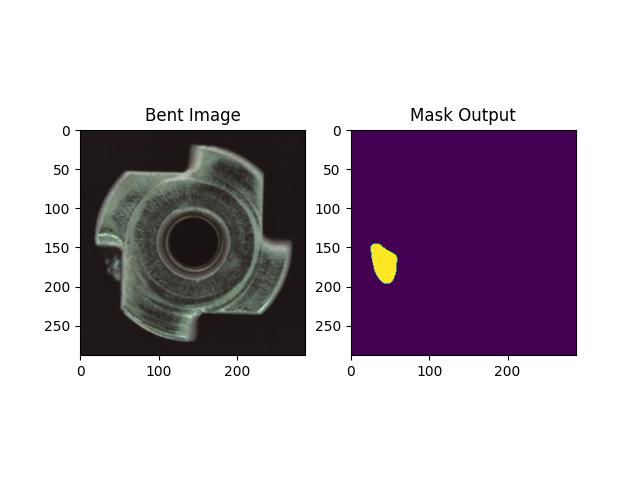
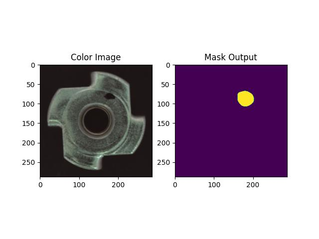
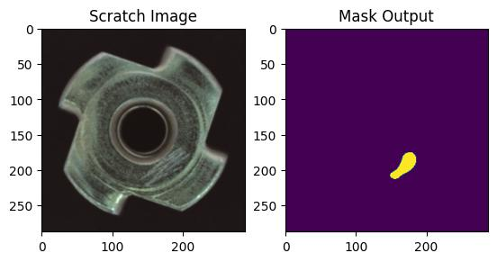

SimpleNet: A Simple Network for Image Anomaly Detection and Localization

### Note

* The default dataset is `metal_nut` from `MVTec`

### Installation

```
conda create -n PyTorch python=3.8
conda activate PyTorch
conda install pytorch torchvision torchaudio cudatoolkit=10.2 -c pytorch-lts
pip install opencv-python==4.5.5.64
pip install scikit-learn
pip install scipy
pip install tqdm
```

### Train

* Configure your dataset path in `main.py` for training
* Download pretrained weights and place it under `weights` folder, see `Pretrained weights`
* Run `python main.py --train` for training

### Test

* Configure your dataset path in `main.py` for testing
* Run `python main.py --test` for testing

### Results

| Backbone | Epochs | F1 (%) | Accuracy (%) | AUROC (%) |                                                                        Pretrained weights |
|:--------:|:------:|-------:|-------------:|----------:|------------------------------------------------------------------------------------------:|
| ResNet18 |  150   |   97.4 |         95.7 |      99.1 |  [model](https://github.com/jahongir7174/SimpleNet/releases/download/v0.0.1/resnet18.pth) |
| ReNet34  |  150   |   97.4 |         95.7 |      99.3 |  [model](https://github.com/jahongir7174/SimpleNet/releases/download/v0.0.1/resnet34.pth) |
| ReNet50  |  150   |    100 |          100 |       100 |  [model](https://github.com/jahongir7174/SimpleNet/releases/download/v0.0.1/resnet50.pth) |
| ReNet101 |  150   |      - |            - |         - | [model](https://github.com/jahongir7174/SimpleNet/releases/download/v0.0.1/resnet101.pth) |
| ReNet152 |  150   |      - |            - |         - | [model](https://github.com/jahongir7174/SimpleNet/releases/download/v0.0.1/resnet152.pth) |






#### Reference

* https://github.com/DonaldRR/SimpleNet
